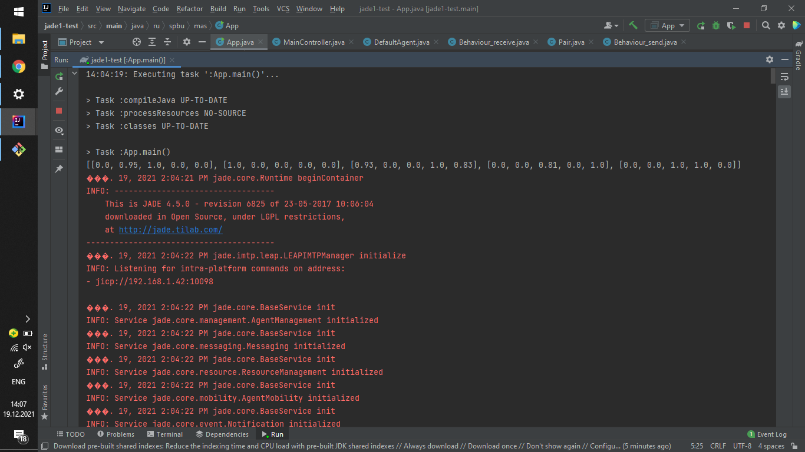
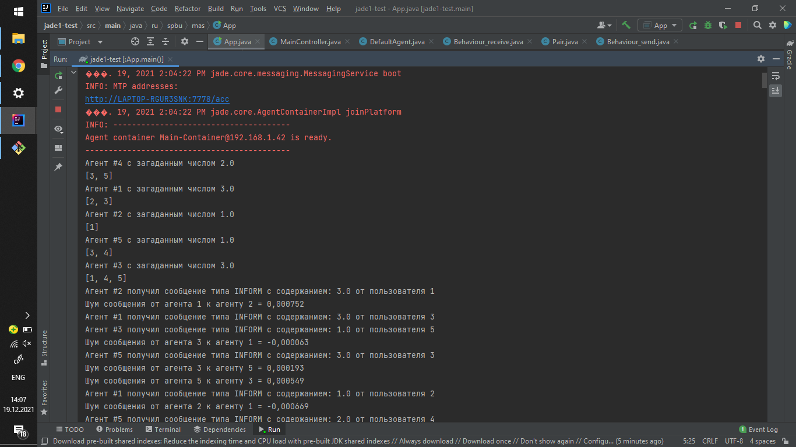
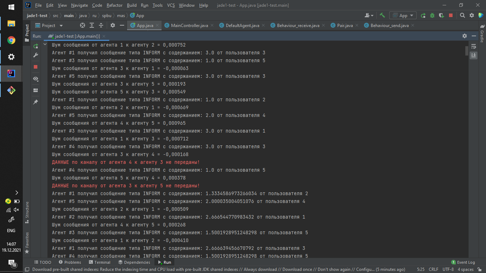
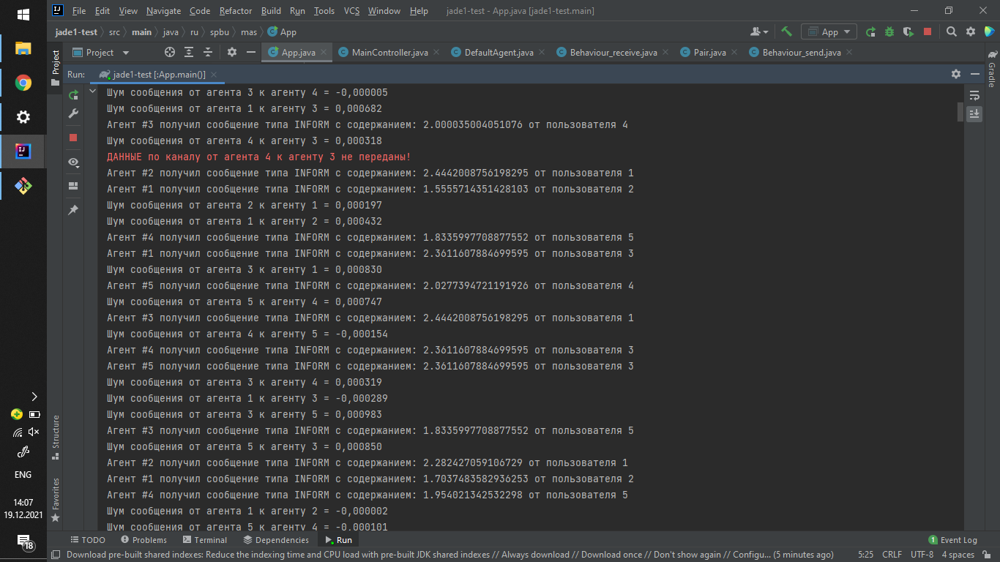
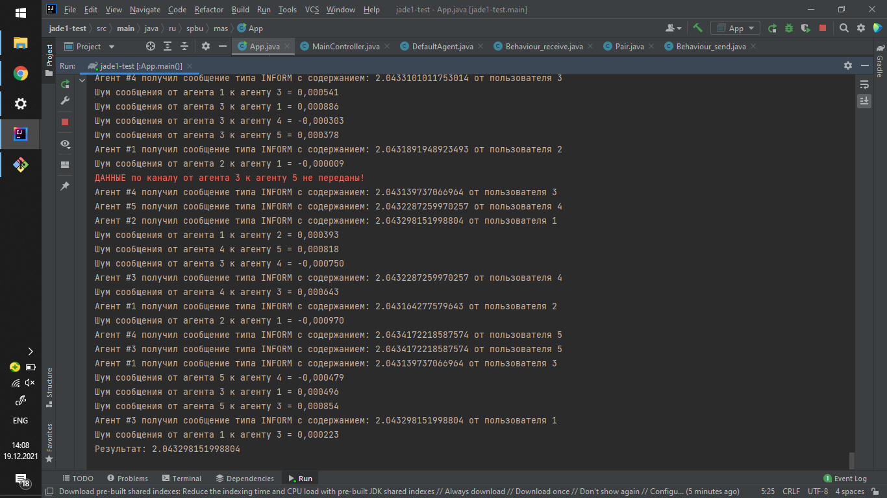

# MultiAgentSystems

## Задание 2
19.12.2021

**Есть n агентов. Каждый из них загадывает какое-то число. 
Нужно посчитать среднее арифметическое. 
Топология - произвольный ориентированный граф, может меняться(исчезать на время и появляться каналы связи). 
При передаче данных возможны задержки, зашумления и обрывы в каналах связи.**

## Решение задания 2
[Код задания 2](https://github.com/gitmskhl/MultiAgentSystems/tree/main/Task2)

### Описание решения (в общем)
Реализуется протокол локального голосования. 
Каждый агент знает соседей, которым он может отправить данные(при этом не знает тех, кто ему может отправить).
Агенты загадывают числа и начинают работу алгоритма.

Сам алгоритм довольно прост. Есть определенное количество итераций тиков, в течении которых работает алгоритм.
Каждый тик начинается следующим образом: агенты отправляют всем своим соседям(которым могут отправить, если каналы связи есть)
свое число в виде сообщения с перформативом INFORM. 

После этого каждый агент переходит в режим ожидания сообщений от других агентов. Если сообщение от агента получено,
то по формуле в протоколе локального голосования, вычисляется промежуточная сумма. В конце каждого тика(или в начале следующего)
эта вычисленная промежуточная сумма становится числом данного агента. В общем, все как в формуле. 

Таким образом, через некоторое количество итераций алгоритм завершает свою работу и 1-й агент печатает свое число(теоретически, должен быть достигнут консенсус, поэтому все числа у агентов +- одинаковые).

### Детали решения

Каждый канал связи имеет задан вещественным числом от 0 до 1 - вероятность того, что по каналу связи можно передать данные.
Благодаря этому имитируются обрывы связи - когда агент хочет передать сообщение, он с вероятностью в вес этого канала связи может его передать. А может и не передать на конкретной итерации.

Шум(или помехи) имитируются добавлением случайного рандомного числа агентом в значение, которое было принято от соседа. Тут все просто.

В алгоритме локального голосования учитываются задержки при отправке данных. Это значит, что, теоретически, агент передал сообщение и оно достаточно долго доходило до другого агента.
Можно по-разному имитировать этот процесс. В коде данного решения имитация происходит за счет буферизации приходящих данных, тесно связано с обрывами связи.

Когда происходит обрыв связи данные не передаются. Но вместо этого принимающий агент использует значения данных из буфера в качестве данных, которые якобы пришли от отправляющего агента с задержкой.

## Инструкция к коду
### Замечания к коду
#### Способ задания графа

Граф связей задается посредством матрицы смежности, причем каждый канал связи задается некоторым вещественным числом - вероятностью того, что канал связи не оборвется.
Это задается в классе App метода [initGraph](https://github.com/gitmskhl/MultiAgentSystems/blob/34aa124f828c31678a97c7d96eb9940fb2aa1f90/Task2/src/main/java/ru/spbu/mas/App.java#L35).

#### Количество итераций и зашумления

В классе App заранее задано [максимальное количество итераций(тиков)](https://github.com/gitmskhl/MultiAgentSystems/blob/34aa124f828c31678a97c7d96eb9940fb2aa1f90/Task2/src/main/java/ru/spbu/mas/App.java#L13) и [среднее значение шума](https://github.com/gitmskhl/MultiAgentSystems/blob/34aa124f828c31678a97c7d96eb9940fb2aa1f90/Task2/src/main/java/ru/spbu/mas/App.java#L14).

Количество итераций - это что-то очень субъективное под данную задачу и под данный алгоритм. Впринципе можно следить за среднестатистическим отклонением значений у данного агента и когда оно стабилизируется на каком-то конкретном - завершать.
Но в данном случае это не требуется(было лень реализовывать), тут достаточно 100 итераций(и то с избытком). 

#### Информация о выводе

В классе App есть [поля](https://github.com/gitmskhl/MultiAgentSystems/blob/34aa124f828c31678a97c7d96eb9940fb2aa1f90/Task2/src/main/java/ru/spbu/mas/App.java#L18), которые отвечают за вывод информации о ходе работы алгоритма.

Там можно настраивать вывод, описание в самом коде.

#### Коэффициент в формуле локального голосования

В формуле ПЛГ фигурирует определенный коэффициент, который по дефолту равен 1/(количество агентов + 1). Если это значение напрягает, то его можно изменить [тут](https://github.com/gitmskhl/MultiAgentSystems/blob/34aa124f828c31678a97c7d96eb9940fb2aa1f90/Task2/src/main/java/ru/spbu/mas/DefaultAgent.java#L24).

#### Поправка на шум

[Здесь](https://github.com/gitmskhl/MultiAgentSystems/blob/34aa124f828c31678a97c7d96eb9940fb2aa1f90/Task2/src/main/java/ru/spbu/mas/Behaviour_receive.java#L27) представлена имитация шума в канале связи. Опять же, если формула не нравится, можно придумать что-то другое. Здесь делается генерация шума от значений [-App.NOISE, APP.NOISE].

### Пример работы

На скринах ниже представлены примеры работы алгоритма.

Как можно видеть, общая сумма загаданных значений равна 10. Значит среднее арифметическое равно 10/5 = 2.

Окончательный результат 2.043. Ошибка 0.04.
Следует отметить, что окончательное значение не абсолютно точное из-за возникающих шумов, задержек и обрывов каналов связей.
Но точность приемлемая.

## Задание 1
16.11.2021

**Есть n агентов. Каждый из них загадывает какое-то число. Нужно посчитать среднее арифметическое (топология не задана).**

## Решение задания 1
[Код задания 1](https://github.com/gitmskhl/MultiAgentSystems/tree/main/Task1)
### Описание решения
Идея алгоритма заключается в следующем: нам дан неориентированный
связный граф(вершины - это агенты, ребра - это каналы связи между агентами).
Вначале агенты генерируют случайные числа. Каждому агенту известны свои соседи, свой id и загаданное число.
Также агентам известно общее число агентов.

Начинается процесс голосования. Результатом голосования является выбор главного агента, который будет
запускать процесс подсчета среднего арифметического и отдавать его в центр по окончании процесса.

После того, как голосование окончено и выбран главный агент, начинается сама фаза подсчета. Главный
агент отправляет всем своим соседям сообщение с перформативом REQUEST, которое сигнализирует о том,
чтобы агент начал процесс вычисления и результат передал тому агенту, который вызвал его.
Те агенты, которые получили это сообщение, делают тоже самое и так начинается ловинообразная передача
этих сообщений по всему графу. Каждый агент, который сделал такие вызову к своим соседям, ожидает от них
ответа. Ответом может быть 2 вида сообщений: либо с перформативом INFORM, которое содержит пару числе (sum, n),
либо же REFUSE, которое сигнализирует о том, что агент заблокирован другим агентом и не будет ничего
передавать.

По окончании данного алгоритма главный агент получит пару чисел (sum, n), на основе которой он получит результат
sum / n.

#### Голосование
У каждого агента имеется состояние. Оно бывает типа "-1", "0", "1" и "2". Изначально все агенты имеют состояние "-1"
Для того, чтобы начать процесс вычисления, агенты должны договориться с тем, кто будет главным инициатором вычислений и будет отправлять результат в центр. Для этого проводится голосование.

Каждый агент хранит пару значений (degV, id), где degV - это число соседей. Главным агентом будем выбирать того агента, для которого эти значения максимальны(очевидно, что коллизий быть не может)

На 1-м такте каждый агент посылает своим соседям пару (degV, id). Принимая сообщения от других соседей, он сравнивает их со своей парой (degV, id), и если его пара меньше чем та, которую ему отослали, то он сохраняет максимальную пару (degV_max, id_max), котороую он получил от соседей.

Условно говоря, на 1-м такте происходит следующее:
1. Отправить всем соседям (degV, id)
2. Создать пару (degV_max, id_max) = max ((degV, id), (degV1, id1), (degV2, id2), ..., (degVk, idk)), где (degVk, idk) - это пара, полученная от соседа k

Далее, на каждом следующем такте каждый агент делает тоже самое, что и на 1-м, только в качестве (degV, id) выступает обновленное значение максимальной полученной пары на предыдущих тактах, т.е. обновленная (degV_max, id_max)
1. Отправить всем соседям (degV_max, id_max)
2. Обновить пару (degV_max, id_max) = max ((degV_max, id_max), (degV1, id1), (degV2, id2), ..., (degVk, idk)), где (degVk, idk) - это пара, полученная от соседа k

Теоретически, агент с максимальной парой (degV, id) передаст через своих соседей и далее по графу до самого последнего агента за количество ребер, которые стоят между ним и самой дальней от него вершиной. Очевидно, что это число не больше числа вершин.
Поэтому если провести ровно n тактов, то в графе каждая вершина сохранит значение максимальной пары и будет определен главный агент просто по сопоставлению со своей изначальной парой значений, т.е. isMain = (degV, id) == (degV_max, id_max)

После окончания всех тактов голосование оканчивается, все агенты переходят в состояние "0".

#### Процесс вычисления
Главный агент отсылает сообщения типа REQUEST всем своим соседям. После этого меняет свое состояние на "1".
Каждый из других агентов в состоянии "0" делает следующее:
- ничего не делает, пока не получит хотя бы 1 сообщение
- если сообщение получено и оно типа REQUEST, то агент запоминает того, от кого он его получил и переходит в состояние "1". При этом он точно также посылает всем соседям REQUEST.

Поведение агента в состоянии "1":
- ожидает ответа от всех своих соседей, которым послал сообщение REQUEST. Причем ожидает именно сообщений типа INFORM или REFUSE.
- если сосед передал сообщение с перформативом INFORM, то агент парсит это сообщение(оно имеет вид пары (req_sum, req_n)), и прибавляет к своей (sum, n) = (sum + req_sum, n + req_n)
- если получено сообщение с перформативом REFUSE, то считается, что сосед ответил, но пара чисел (sum, n) не обновляется
- если получает сообщение от других агентов типа REQUEST, то мгновенно отвечает им REFUSE.
- после того, как все соседи ответили сообщениями с перформативами INFORM или REFUSE, агент к полученной паре (sum, n) добавляет свое загаданное число и 1, т.е. (sum, n) = (sum + number, n + 1). После этого отправляет эту пару в сообщении типа INFORM своему агенту (если агент является главным, то результат (sum, n) отправляется в центр) и переходит в состояние "2"

Поведение агента в состоянии "2":
- ничего не делает, пока не получит хотя бы 1 сообщение
- если сообщение получено, то вне зависимости от типа сообщения, агент отправляет сразу же ответ REFUSE

Формально можно доказать то, что алгоритм:
1. Конечен
2. Корректен

### Оценка решения
m - число ребер (число линий связи)

n - число вершин (агентов)

Оценки приведены для 2-х случаев(лучший и худший), в зависимости от топологии.

| Случай | Память | Кол-во сообщений локально | Кол-во операций | Время(такты) | Кол-во ребер | Кол-во сообщений в центр |
| ------ | ------ | ------------------------- | --------------- | ------------ | ------------ | ------------------------ |
| Лучший | O(m)   | O(m * n + m)              |   4m            | O(1)         |не меньше n-1 | 1
| Худший | O(m)   | O(m * n + m)              |   4m            | 3*n+3 = O(n) |не меньше n-1 | 1

## Инструкция к коду
### Замечания по установке и запуску проекта с JADE

[Инструкция к установке](https://www.math.spbu.ru/user/gran/PP/JADE.pdf)

В приведенном решении есть файл [build.gradle](https://github.com/gitmskhl/MultiAgentSystems/blob/main/Task1/build.gradle), который ссылается на jar'ник в папке libs с именем jade-4.5.0.jar. Добавьте папку libs на том же уровне вложения проекта, что и папка main и добавьте туда файл jar'ник. Если у него другое имя, то не забудьте поменять имя в файле build.gradle.

### Замечения к коду
В файле [App.java](https://github.com/gitmskhl/MultiAgentSystems/blob/main/Task1/src/main/java/ru/spbu/mas/App.java) есть несколько методов инициализации, при выборе каждого из которых следует внимательно следить за параметром [APP.AGENT_NUMBERS](https://github.com/gitmskhl/MultiAgentSystems/blob/8182327325ce9ab84fa31071287ef665cc2a33a6/Task1/src/main/java/ru/spbu/mas/App.java#L12): 
- В случае выбора метода [initStar](https://github.com/gitmskhl/MultiAgentSystems/blob/8182327325ce9ab84fa31071287ef665cc2a33a6/Task1/src/main/java/ru/spbu/mas/App.java#L27) параметр APP.AGENT_NUMBERS может быть любым
- В случае выбора метода [initTop1](https://github.com/gitmskhl/MultiAgentSystems/blob/8182327325ce9ab84fa31071287ef665cc2a33a6/Task1/src/main/java/ru/spbu/mas/App.java#L42) параметр APP.AGENT_NUMBERS должен быть равен 5
- В случае выбора метода [initTop2](https://github.com/gitmskhl/MultiAgentSystems/blob/8182327325ce9ab84fa31071287ef665cc2a33a6/Task1/src/main/java/ru/spbu/mas/App.java#L60) параметр APP.AGENT_NUMBERS должен быть равен 11

Все эти тонкости связаны просто с тем, что инициализация сделана достаточно коряво. Ее можно сделать нормальной, но это к заданию отношения не имеет.

Во время процесса голосования каждый такт выполняется через 1 секунду. Это установлено [вот тута](https://github.com/gitmskhl/MultiAgentSystems/blob/235ed582e7fcb10c7ebb16a07acaf6eac90511a6/Task1/src/main/java/ru/spbu/mas/DefaultAgent.java#L40) и если не хочется ждать по 1 секунде на каждый такт, то просто поставьте значение в миллисекундах.